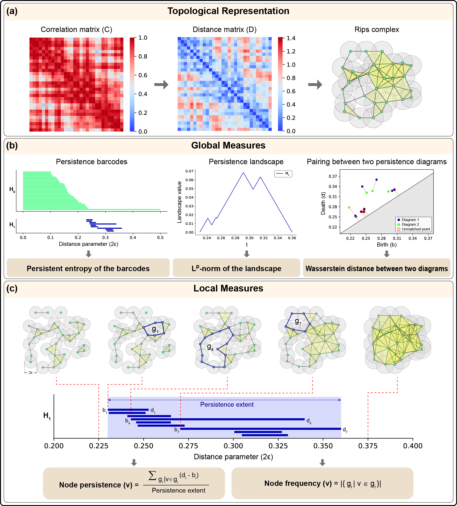

# NodePersistence_PH_FCM

## About
This repository contains the codes and data associated with the following manuscript:  

Madhumita Mondal, Yasharth Yadav, Jürgen Jost*, and Areejit Samal*, [<i>Node persistence from topological data analysis reveals changes in brain functional connectivity</i>]  
(* Corresponding authors)
 

The repository contains three folders: Code, Data, and OutputFiles. A description of the files contained in each folder is provided below.

## Code
Contains all the necessary codes to reproduce the results in the manuscript.

1. Holes (folder): Contains codes to construct Homological Scaffold

2. lib (folder): Contains Javaplex library

3. 01_data_preprocessing.ipynb: To construct distance matrix from the functional connectivity (FC) matrix.

4. 02_Gudhi_run_PEL1L2.ipynb: Calculates persistent entropy, $L^1$-norm, and $L^2$-norm, from the distance matrices on global scale using the Gudhi library.

5. 03_Gudhi_run_RSNs_PELIL2.ipynb: Calculates persistent entropy, $L^1$-norm, and $L^2$-norm, from the distance matrices on RSN level using the Gudhi library.

6. 04_Wasserstein_distance.ipynb: Calculates 1-Wasserstein,  2-Wasserstein, and bottleneck distances, on global scale as well as RSN level using the Gudhi library.

7. 05_CallJython_for_1DHoles.ipynb: Call Jython code to get representative cycles of one-dimensional holes.

8. 06_NodePersist&Freq_1DHoles.ipynb: To calculate Node persistence and Node frequency. Also, perform the statistical test.

9. 07_NeurosynthAnalaysis.ipynb: To perform Neurosynth meta analaysis.

10. 08_Homological_Scaffold_and_NodalPSS.ipynb: To calculate the Nodal PSS from homological scaffolds. Also, perform the statistical test.

11. jython_code_VRcomp_global_PosCorr.py: Jython code to get representative cycles of one-dimensional holes.

12. Violin_plot_global_PEL1L2.ipynb: To generate violin plots for persistent entropy, $L^1$-norm, and $L^2$-norm on global scale.

13. Violin_plot_global_W1W2BD.ipynb: To generate violin plots for 1-Wasserstein,  2-Wasserstein, and bottleneck distances on global scale.

14. Violin_plot_RSNs_PosCorr_PEL1L2.ipynb: To generate violin plots for persistent entropy, $L^1$-norm, and $L^2$-norm on RSN level.

15. Violin_plot_RSNs_PosCorr_W1W2BD.ipynb: To generate violin plots for 1-Wasserstein, 2-Wasserstein, and bottleneck distances on RSN level.

## Data
Contains the necessary data to obtain the plots

1. ABIDE

a. FCM_CorrMat_asList (folder): Contains FC matrices corresponding to 820 subjects.

b. FCM_DistMat (folder): Stores distance matrices constructed from the FC matrices.

c. ABIDE_Subject_details.csv: Details of the 820 subjects.

d. Phenotypic_ADI_R.csv: Phenotypic ADI-R scores of some ASD subjects.

2. MPI_LEMON

a. FCM_CorrMat_asList (folder): Contains FC matrices corresponding to 225 subjects.

b. FCM_DistMat (folder): Stores distance matrices constructed from the FC matrices.

c. BehavioralRelevance (folder): Behavioral Scores of all 225 subjects.

d. MPILemon_Subject_details.csv: Details of the 225 subjects.

3. Cognitive_terms_SchaeferAtlas.csv : Cognitive terms of the regions in Schaefer Atlas.

4. NIBS_Identified_ROIs.csv: Regions identified by non-invasive brain stimulations.

5. SchaeferAtlas_Regions_details.cs: Details of the 200 regions in Schaefer Atlas.

## OutputFiles
Contains three folders: AllCorr, PosCorr, and Output_Plots

1. AllCorr

Contains two folders: 'ABIDE' and 'MPI_LEMON', to store the outputs of ABIDE and MPI-LEMON datasets, respectively, corresponding to the analysis considering all the correlations from the FC matrices.

2. PosCorr

Contains three folders: 'ABIDE', 'MPI_LEMON', and 'NeurosynthAnalaysis'. 
ABIDE and MPI_LEMON folder store the outputs of ABIDE and MPI-LEMON datasets, respectively, corresponding to the analysis considering only the positive correlations from the FC matrices.
NeurosynthAnalaysis contains the results corresponding to Neurosynth meta analaysis.

3. Output_Plots

Contains all the violin plots present in the manuscript (can be generated as well from the given code)

## Citation
In case you use the codes herein, please cite the following manuscript:

Madhumita Mondal, Yasharth Yadav, Jürgen Jost*, and Areejit Samal*, and [<i>Node persistence from topological data analysis reveals changes in brain functional connectivity</i>].
